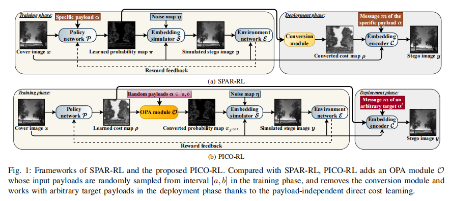
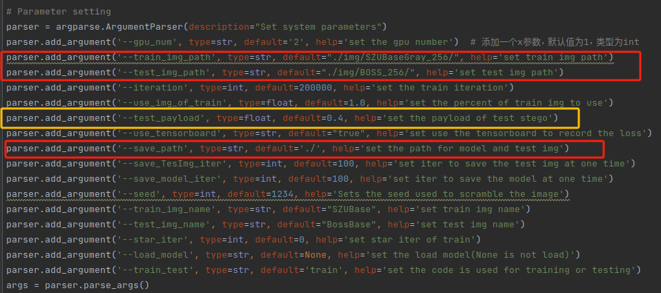
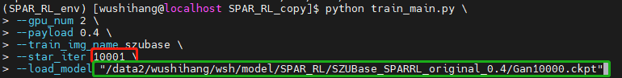
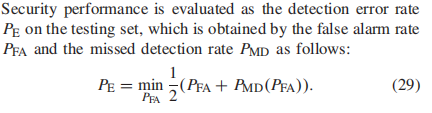
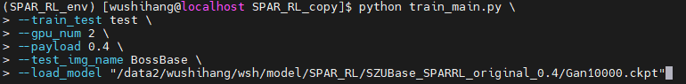

# PICO-RL：Payload-Independent Direct Cost Learning for Image Steganography



# Paper（TCSVT 2023）

[Payload-Independent Direct Cost Learning for Image Steganography](https://ieeexplore.ieee.org/document/10178049)

Innovation: Framework directly learns universal direct costs that can be applied to any payload

# Code Usage 

There are no extra compiled components in PICO-RL and package dependencies are minimal, so the code is very simple to use. We provide instructions how to install dependencies via conda. First, clone the repository locally:

```bash
git clone https://github.com/a-pig-akab/PICO-RL_porject.git
```

Next, make sure you have a distribution of anaconda on your system, and create a virtual environment with anaconda from the command line and activate it, as follows (if you are using a local python environment and include pip-related dependencies, you can skip this step) :

```bash
# Create a virtual environment called PICO_RL_env, python 3.7.4
conda create -n PICO_RL_env python=3.7.4

# Activate virtual environment
conda activate PICO_RL_env
```

Then, We index to the PICO-RL project path and install the project's dependency packages using pip:

```bash
# Index to the PICO-RL project file path
cd path/of/PICO-RL-object

# pip installation-related dependencies
pip install -r requirements.txt
```

## Data preparation

In order to better reproduce the code, we need to download the training image and the test image respectively. Here, we provide the Baidu web disk links of the Bossbase1w image libraries used in the paper, and then download and decompress them to the img folder in the project folder (**or use the soft link of linux**). You do not need to set the image path of the code, the download link and the corresponding image storage path are as follows:

| Image               | url                                                          | size(.zip) |
| ------------------- | ------------------------------------------------------------ | ---------- |
| Bossbase1w(256x256) | [download](https://pan.baidu.com/s/1-PimaW3y2nBWUS2kWas-ug?pwd=6666) | 404.41Mb   |

```bash
.
├── batch_norm_layer.py
├── img
│   ├── BOSS_256			# test img
│   └── SZUBaseGray_256		 # train img
├── requirement.txt
└── train_main.py
```

## Training

After downloading the images and configuring the environment, you can train the PICO-RL model by entering the following command in the command line(**If you have extracted the images to the corresponding paths earlier, you may not need to set the `train_img_path` and `test_img_path` parameters**):

```bash
# Run command
python train_main.py \
    # Mandatory parameter
    --train_test train \
    --train_img_path path/of/train/img \
    --test_img_path path/of/test/img \
    --test_payload 0.4 \
    --save_path path/of/train/model/to/save \
    --train_img_name name of img \
    # Optional parameter
    --gpu_num 0 \
    --iteration 200000 \
    --use_tensorboard true \
    --save_TesImg_iter 10000 \
    --save_model_iter 10000 \
    --seed 1234 \
```

If you do not want to repeatedly enter the related path in the command line, you can directly enter the following part of the code to set the default parameters:



**PS:**  The code will save the model after a certain number of iteration and use the model to generate the test image library. If multiple test image libraries are not required, you can change the `save_TesImg_iter` parameter to change the iteration interval of the save image library. Prevents generating too many test image libraries from taking up system space.

If the training process is interrupted, we can choose to load the saved model for training. Such as if it is interrupted at 1w iteration, the following code can be used to continue training:

```bash
# Run command
python train_main.py \
    # Mandatory parameter
    --train_test train \
    --train_img_path path/of/train/img \
    --test_img_path path/of/test/img \
    --test_payload 0.4 \
    --save_path path/of/train/model/to/save \
    --train_img_name name of img \
    # load model
    --star_iter 10001 \
    --load_model path/of/2w/model # The model path of this code is save_path/Gan{star_iter}.ckpt
```

A simple example is as follows:



## Testing

In the code of this project, we provide the Baseline model that is repeated and similar to the performance of the paper. The description of evaluation indicators, the link to download the model and the performance comparison with the paper are shown in the following table (training image is SZUBase, test image is BOSSBase1w) :

- Evaluation index specification



- Model Zoo

  | Baseline payload | Performance P_E（SRM/SRNet） | url                                                          |
  | ---------------- | ---------------------------- | ------------------------------------------------------------ |
  | 0.05bpp          | 0.4801/0.4578                | [model](https://pan.baidu.com/s/1L2ZITdDnYLouHAIpscJwBw?pwd=6666) |
  | 0.4bpp           | 0.3066/0.2685                | Same as above                                                |

If no training is required and only Baseline Model provided in the project is used to test the image library, we can use the following code:

```bash
# Run command
python train_main.py \
    --train_test test \
    --test_img_path path/of/test/img \
    --test_payload 0.4 \
    --save_path path/of/train/model/to/save \
    --test_img_name BossBase \
    --load_model path/of/baseline_model
```

A simple example is as follows:



# Contact

We are glad to hear from you, if our code is helpful to you, please give us a star or cite our paper, it will be the greatest encouragement for our work. If you have any questions, please feel free to contact [2020285059@email.szu.edu.cn](mailto:2020285059@email.szu.edu.cn), [liweixiang@szu.edu.cn](mailto:liweixiang@szu.edu.cn).

---

# 代码使用指南

在PICO-RL的代码中没有额外编译的组件，并且包依赖关系最小，因此代码非常易于使用。我们提供了如何通过conda安装依赖项的说明。首先，在本地克隆项目：

```bash
git clone 
```

接下来，确保您的系统上有anaconda的发行版，并使用anaconda从命令行创建一个虚拟环境并激活它，如下所示(如果您使用的是本地python环境并包含pip相关的依赖项，您可以跳过此步骤)：

```bash
# Create a virtual environment called PICO_RL_env, python 3.7.4
conda create -n PICO_RL_env python=3.7.4

# Activate virtual environment
conda activate PICO_RL_env
```

然后，我们索引PICO-RL项目路径，并使用pip安装项目的依赖包：

```bash
# Index to the PICO-RL project file path
cd path/of/PICO-RL-object

# pip installation-related dependencies
pip install -r requirements.txt
```

## 数据准备

为了更好地复现代码，我们需要分别下载训练图像和测试图像。在这里，我们提供了本文使用的Bossbase1w图像库的百度网盘链接，然后下载并解压到项目文件夹中的img文件夹中(**或使用linux的软链接**)，可不用设置代码的图像路径，如下：

| Image               | url                                                          | size(.zip) |
| ------------------- | ------------------------------------------------------------ | ---------- |
| Bossbase1w(256x256) | [download](https://pan.baidu.com/s/1-PimaW3y2nBWUS2kWas-ug?pwd=6666) | 404.41Mb   |

```bash
.
├── batch_norm_layer.py
├── img
│   ├── BOSS_256			# test img
│   └── SZUBaseGray_256		 # train img
├── requirement.txt
└── train_main.py
```

## 训练

下载图像并配置环境后，您可以通过在命令行中输入以下命令来训练PICO-RL模型(**如果您之前已经将图像提取到相应的路径，则可能不需要设置' train_img_path '和' test_img_path '参数**)：

```bash
# Run command
python train_main.py \
    # Mandatory parameter
    --train_test train \
    --train_img_path path/of/train/img \
    --test_img_path path/of/test/img \
    --test_payload 0.4 \
    --save_path path/of/train/model/to/save \
    --train_img_name name of img \
    # Optional parameter
    --gpu_num 0 \
    --iteration 200000 \
    --use_tensorboard true \
    --save_TesImg_iter 10000 \
    --save_model_iter 10000 \
    --seed 1234 \
```

如果不希望在命令行中重复输入相关路径，可以直接输入以下部分代码设置默认参数：


**PS:** 代码将在迭代一定次数后保存模型，并使用该模型生成测试图像库。如果不需要多个测试图像库，您可以更改' save_TesImg_iter '参数来更改保存图像库的迭代间隔。防止生成过多的测试图像库占用系统空间。

如果训练过程中断，我们可以选择加载保存的模型进行训练。例如，如果在第1w次迭代时被中断，则可以使用以下代码继续训练：

```bash
# Run command
python train_main.py \
    # Mandatory parameter
    --train_test train \
    --train_img_path path/of/train/img \
    --test_img_path path/of/test/img \
    --test_payload 0.4 \
    --save_path path/of/train/model/to/save \
    --train_img_name name of img \
    # load model
    --star_iter 10001 \
    --load_model path/of/2w/model # The model path of this code is save_path/Gan{star_iter}.ckpt
```

一个简单示例如下：


## 测试

在该项目的代码中，我们提供了复现的Baseline Model，该模型与论文的性能相似。评价指标描述、模型下载链接以及与论文的性能对比见下表(训练图像为SZUBase，测试图像为BOSSBase1w)：

- 评价指标规范


- Model Zoo

  | Baseline payload | Performance P_E（SRM/SRNet） | url                                                          |
  | ---------------- | ---------------------------- | ------------------------------------------------------------ |
  | 0.05bpp          | 0.4801/0.4578                | [model](https://pan.baidu.com/s/1L2ZITdDnYLouHAIpscJwBw?pwd=6666) |
  | 0.4bpp           | 0.3066/0.2685                | 同上                                                         |

如果不需要训练，只使用项目中提供的Baseline Model来测试图片库，我们可以使用以下代码：

如果不需要训练，只使用项目中提供的Baseline Model来测试图片库，我们可以使用以下代码：

```bash
# Run command
python train_main.py \
    --train_test test \
    --test_img_path path/of/test/img \
    --test_payload 0.4 \
    --save_path path/of/train/model/to/save \
    --test_img_name BossBase \
    --load_model path/of/baseline_model
```

一个简单示例如下：


# 联系

我们很高兴收到您的来信，如果我们的代码对您有帮助，请给我们一颗星或引用我们的论文，这将是对我们工作最大的鼓励。如果您有任何问题，请随时与我们联系[2020285059@email.szu.edu.cn](mailto:2020285059@email.szu.edu.cn)，[liweixiang@szu.edu.cn](mailto:liweixiang@szu.edu.cn).

